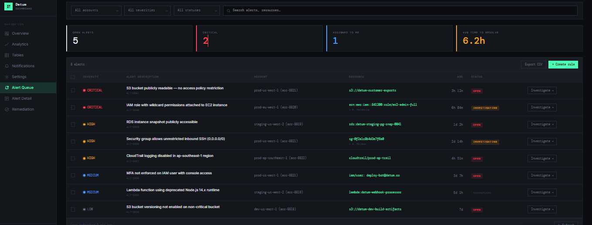
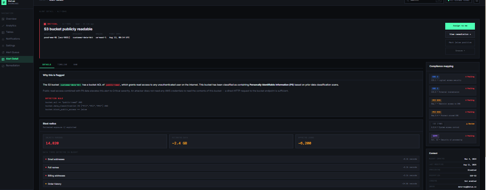
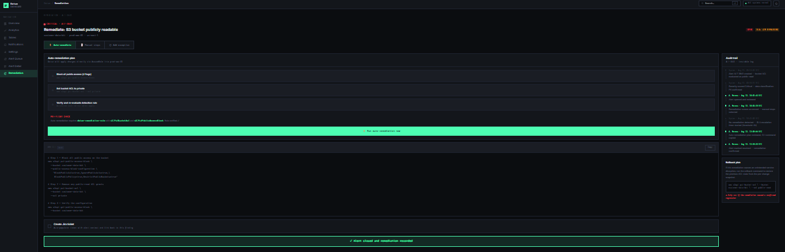

# Alert Triage Workflow — Cloud Security Design Assignment

## 1. Problem Statement

Cloud security teams using a CNAPP (Cloud-Native Application Protection Platform) receive a high volume of alerts every day — misconfigurations, 
IAM risks, exposed resources — spread across multiple AWS, Azure, and GCP accounts. Most of these alerts are not actually urgent, but the tools 
that generate them rarely distinguish between minor issues and real risks. This causes **alert fatigue**: important problems get buried under noise, 
investigation takes too long because context is scattered, and remediation is slow because engineers have to manually verify and fix issues one at a time.

**Core question this design solves:** How does a security engineer go from "300+ open alerts" to "the right one fixed" as quickly and confidently as possible?

## 2. User Persona

**Name:** Riya, Security Engineer
**Context:** Riya works on a small cloud security team responsible for ~15 cloud accounts across AWS and GCP. She starts her day by triaging the alert queue, 
decides what's real vs. noise, investigates the riskiest items first, and either fixes them herself or hands them off.

**Goals:**
- Get to the highest-risk alerts first, not just the newest ones
- Understand *why* something is flagged and *what it actually touches* without digging through raw cloud console logs
- Resolve or dismiss alerts with minimal context-switching
- Have a defensible audit trail for compliance reviews

**Frustrations:**
- Too many low-severity alerts drown out critical ones
- No visibility into blast radius — is this an isolated issue or does it cascade?
- Manual remediation is repetitive for well-understood misconfigurations

## 3. Wireframes

### Screen 1 — Alert Queue

This is the landing screen. It works like a filterable inbox — filters for account, severity, and status sit up top, with summary 
cards giving an at-a-glance health check (open alerts, critical count, alerts assigned to me, average time to resolve). 
The table itself is kept sparse — severity, description, account, resource, age, status — because the goal here is to help someone 
quickly decide what to open next, not show everything at once.

### Screen 2 — Alert Detail / Investigation

Clicking into an alert answers the three questions an engineer actually needs before acting: what's the rule that was violated,
which compliance framework does it affect (useful for justifying urgency), and what's the blast radius — what else is exposed if 
this stays open. Actions (assign, view remediation, mark false positive, snooze) sit right below, so there's no context-switching to act.

### Screen 3 — Remediation & Close-out

This is where the alert actually gets resolved. The engineer can choose one-click auto-remediation for well-understood fixes,
follow manual steps, or add an exception for legitimate cases. A visible audit trail and rollback plan build trust in automated fixes, 
and the flow ends with a clear confirmation that the alert is closed and the fix is recorded.

## 4. Feature Prioritization

**Must have (v1)**
- Filterable alert queue (severity, account, cloud provider, status)
- Alert detail view with plain-language explanation and affected resource
- Assign / snooze / mark false positive actions
- Basic audit trail (who did what, when)

**Should have (v1.1)**
- Blast radius / related-resource context on the detail screen
- Compliance framework mapping (SOC 2, PCI DSS, ISO 27001, GDPR)
- Manual remediation guidance (copyable CLI commands / IaC snippets)

**Could have (v2)**
- One-click auto-remediation for a curated set of low-risk, well-understood misconfigurations
- Exception/allowlist workflow with expiry dates
- Similar-alert clustering ("this pattern occurred 3 times this month")

**Won't have (for now)**
- Fully autonomous remediation with no human approval — too risky for v1. Better earned incrementally after auto-remediate proves reliable on low-stakes rule types.

**Why this order:** The queue and detail view are the backbone — without them, nothing else matters. Blast radius and compliance mapping come next because 
they directly reduce the "is this actually urgent?" decision time, the biggest source of alert fatigue. Auto-remediation is powerful but riskiest to get wrong 
(a bad automated fix could break production), so it's sequenced after trust signals like audit trails and clear rule explanations are already in place.

## 5. Success Metrics

- **Mean time to triage** — time from alert creation to assignment/first action (target: reduce by 40%)
- **Mean time to resolution** — time from triage to closed/remediated
- **False positive dismiss rate** — should stay stable or drop as rule quality improves; a rising rate signals noisy detection
- **% of critical alerts resolved within SLA** (e.g., 4 hours)
- **Auto-remediation adoption rate** (v2) — % of eligible alerts resolved via one-click fix vs. manual

